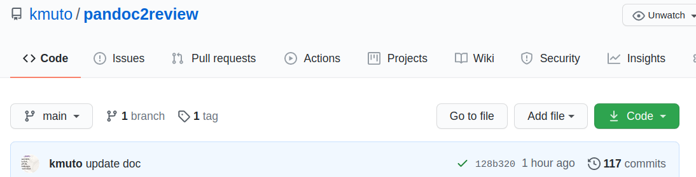

# Re:VIEWプロジェクト内でシームレスにMarkdownファイルを使う

**pandoc2review** を使って Re:VIEW プロジェクト内でシームレスに Markdown ファイルを原稿データとして使うことに挑戦してみます。

といっても、やり方はとても簡単です。

このプロジェクトフォルダ ([https://github.com/kmuto/pandoc2review/tree/main/samples/reviewsample](https://github.com/kmuto/pandoc2review/tree/main/samples/reviewsample)) をコピーして中身を加工するか、`review-init` 等で作成した適当なプロジェクトフォルダに少し手を加えるだけで実現できます。

## セットアップ

1. pandoc2review の実行セットである `pandoc2review` フォルダにパスを通しておきます。
2. `lib/tasks/z01_pandoc2review.rake` をプロジェクトフォルダの `lib/tasks` にコピーします。
3. 章単位で Markdown ファイルを作ります (たとえば ch01.md, ch02.md)。
4. `catalog.yml` に .md → .re に名前を変えた形で登録します。
5. `rake pdf`、`rake epub` などを実行します。

画像は `images` フォルダに以下のどちらかで配置しておいてください。

- `images/〜` と直下に置く
- `images/ch01/〜` とサブフォルダを作る

## 仕組み

`rake` コマンドを呼び出したとき、`lib/tasks/z01_pandoc2review.rake` が手順に追加されます。この中で `catalog.yml` を解析し、re ファイルがあればそれを `_refiles` フォルダにコピーし、md ファイルがあれば `pandoc2review` コマンドで変換して `_refiles` フォルダに `*.re` ファイルとして書き出します。簡単！

## Re:VIEW的なものを入れる例

- spanで章参照: ch02
